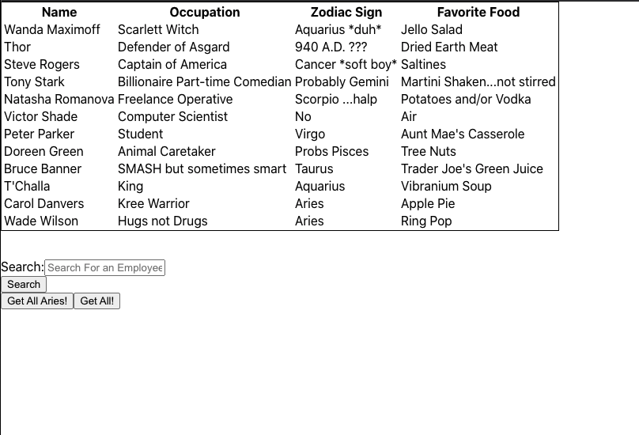

# # exercise-tracker

<a href="https://lilipcohen.github.io/react-directory/">Click here to see it in action.</a>

## Table of Contents

- [Description](#description)
- [Installation](#installation)
- [Usage](#usage)
- [License](#license)
- [Contributions](#contributions)
- [Tests](#tests)
- [Questions](#questions)

## Description

_Overview of this project:_

- I set out to build an application that allows an employer to view their employees non-sensitive information in table format and be able to filter through.

## Installation

_Steps required to install project and get the development environment established:_

- Simply use the npm install command in your terminal to install all necessary packages to launch the exercise based application!

## Usage

_Instructions and examples for use:_

- On the home page you will be presented with 4 items.

1. Table
   1. This will be presented on your screen displaying a table with sections of all the Avengers employees.
2. Search Form
   1. You can enter the name of a person you would like to find and get their information back.
3. Aries Button
   1. If you click on this button you will be presented with just the employees who's zodiac signs are aries.
4. All Button
   1. If you click on this button you will be presented with all the employees.

## License

- Built under the MIT licence.

## Credits

- Built by Lili Cohen.

## Test

- No tests required.

## Questions?

 

#### If you have any questions or want to make a contribution please reach out to me here:

 

**GitHub:**

- @lilipcohen  

**Email:**

- lili.cohen.tv@gmail.com  

**LinkedIn:**

- Lili: http://www.linkedin.com/in/lili-p-cohen
